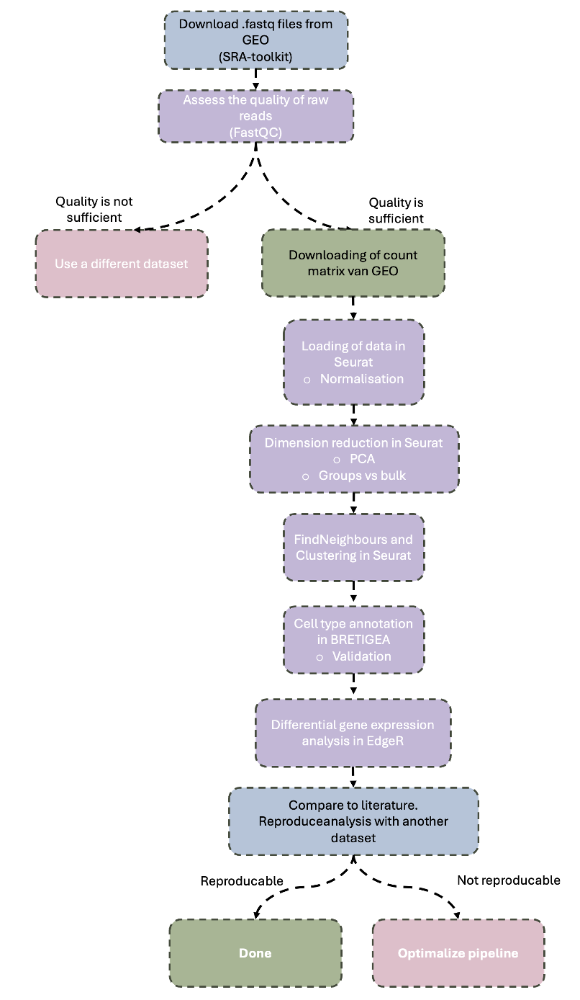

---
output:
  html_document: default
  pdf_document:
    latex_engine: xelatex
header-includes:
  - \usepackage{fontspec}
  - \usepackage{fancyvrb}
  - \usepackage[section]{placeins}
  - \usepackage{float} 
  - \usepackage{blindtext}
  - \setmainfont{DejaVu Sans Condensed}
  - \setsansfont{DejaVu Sans}
  - \setmonofont{DejaVu Sans Mono}
  - \DefineVerbatimEnvironment{Highlighting}{Verbatim}{fontsize=\footnotesize,commandchars=\\\{\}}

---

# Pipeline for Differential Gene Expression (DGE) Analysis in Alzheimers disease

## Contents
- [Data](#data)
- [Folderstructure](#folderstructure)
- [Usage instructions for this repository](#usage-instructions-for-this-repository)
  - [Packages and dependencies](#packages-and-dependencies)
  - [Analysis](#analysis)
- [Authors and contact](#authors-and-contact)

___

## Description
This project aims to develop a reliable and reproducible data-analysis pipeline for single-nucleus RNA sequencing (snRNA-seq) data, with the goal of identifying cell-type-specific differential gene expression (DGE) in Alzheimer’s disease.

The initial research question was:

How can a reliable and reproducible analysis pipeline be established to identify cell-type-specific differential gene expression from snRNA-seq data in Alzheimer’s disease?

During data acquisition, raw FASTQ files were retrieved from the GEO database. However, these files lacked unique molecular identifiers (UMIs) and cell/nucleus barcode information, which are essential for snRNA-seq DGE analysis. Consequently, answering the original research question using raw data was not feasible.
To overcome this limitation, the project was adapted to use the count matrix of GSE138852. This allows for downstream analysis while maintaining the focus DGE-analysis and reproducibility.

**Research question**

How can a reliable and reproducible analysis pipeline be established to identify cell-type-specific differential gene expression in Alzheimer’s disease using a filtered expression matrix from single-nucleus RNA sequencing (snRNA-seq) data?

**Sub-questions**

 1. Do the sequencing reads have a high enough Q-score to further analyse the data (Q ≥ 30)?
 2. Can the most variable genes be identified using the filtered count matrix?
    1. Can the dataset be loaded in its entirety, or must it be divided into two groups (healthy vs. Alzheimer's)?
 3. How can dimension reduction with PCA in Seurat be applied to the combined healthy and Alzheimer's dataset? 
    1. Must the dataset first be grouped by condition?
 4. Can different cell types be distinguished from each other with BRETIGEA based on features found after sequencing RNA from the nuclei?
 5. Can the reliability of annotating different cell types be validated?
 6. What steps are necessary to perform differential gene expression analysis? (This should include looking at differences in expression profiles of the same cell types in both conditions).

**Workflow**



___

## Data
In this project publicly available **DroNc-seq data** is used from the entorhinal cortex published by **Grubman et al.** (GEO ID: [GSE138852](https://www.ncbi.nlm.nih.gov/geo/query/acc.cgi?acc=GSE138852)).

**Raw sequencing data (FASTQ files)**

The raw data consist of paired-end FASTQ files generated from single-nucleus RNA sequencing of post-mortem human entorhinal cortex tissue from individuals with Alzheimer’s disease and healthy controls.
Sequencing libraries were prepared using 10x Genomics Chromium Single Cell 3′ v2, sequencing was performed with the Illumina NextSeq 500 platform.

Each FASTQ file contains sequencing reads derived from individual nuclei and includes cDNA sequence reads, corresponding to the nuclear RNA transcripts. 
These raw reads represent unprocessed sequencing output and require alignment, barcode/UMI processing and normalization before gene expression analysis. 
However, as mentioned in [Description](#description), the barcodes and UMIs are not available in the retrieved FASTQ files.

**Count matrix**

The file ```GSE138852_counts.csv.gz``` contains a processed gene expression count matrix generated from the raw FASTQ files by Grubman _et al_ (2019). 
Reads were aligned to a pre-mRNA human reference genome (GRCh38) and quantified using Cell Ranger. The aligned reads, cell barcodes and UMIs were used to create the count matrix.
The resulting matrix contains raw UMI counts, with rows corresponding to genes and columns corresponding to individual nuclei. 
The following filters were applied for quality control: 

 - 100 genes associated with the post-mortem interval (PMI) were excluded from the dataset.
 - Nuclei with a number of detected genes outside the 5th and 95th percentiles were excluded.
 - Nuclei with a total UMI count outside the 5th and 95th percentiles were excluded.
 - Nuclei in which more than 10% of UMIs were assigned to mitochondrial RNA were excluded.
The final dataset includes 13,214 high-quality nuclei and 10,850 genes. 

___

## Folderstructure
For this project the following folder structure was used:

```
~/ad_transcriptomics_dge
├── RMarkdowns
├── analyses
│   └── fastqc
│       └── multiqc_data
├── raw_data
├── references
├── renv
│   ├── library
│   └── staging
├── scripts
└── seurat
    └── filtered_gene_bc_matrices
        └── hg19
```
___

## Usage instructions for this repository

### Packages and dependencies
Prior to any analysis the required packages need to be installed, installation of Rpackages is managed by ```renv``` for other packages ```conda``` is used. 

**To install ```renv``` and set up the project the instructions are as followed;**

1. Install the renv package from the console:

```r
install.packages("renv")
```

2. Check if the renv.lock file was fetched after cloning this repository, if this is not the case the packages won't be installed properly:

```r
file.exists("~/ad_transcriptomics_dge/renv.lock")
```

3. Restore the project environment:

```r
renv::restore()
```

**To install ```conda```, set up an environment and install packages the instrucions are as followed;**

1. Navigate to the home directory and download the script to install conda from the console:

```bash
cd ~
wget https://repo.anaconda.com/miniconda/Miniconda3-latest-Linux-x86_64.sh
```

2. Run the script from the console:

```bash
bash Miniconda3-latest-Linux-x86_64.sh
```

3. Answer the questions as followed; 
   1. yes > license
   2. installation location: press Enter (~/miniconda3)
   3. conda init > yes

4. Check if conda is installed, the output should be ```conda 25.3.1```:

```bash
conda --version
```

5. Create a conda environment named "snrnaseq": 
``` bash 
conda create -n snrnaseq
```

6. Activate conda environment, the environment name should be visible in de command line after this: 
```bash
conda activate snrnaseq
```
7. Install required packages in the environment:

sra-toolkit:
``` bash
conda install bioconda::sra-tools
```

FastQC:
```bash
conda install bioconda::fastqc
```

STAR:
``` bash
conda install bioconda::star
```

Whenever one of the packages installed in a conda environment are used in a script, the conda environment should be activated prior to running this script.

**The following packages are listed by renv as direct dependencies:**

| Package         | Version     |Package manager|
|-----------------|-------------|---------------|
|```renv```       |```1.1.5.``` |      N/A      |
| ```miniconda``` |```25.3.1``` |      N/A      |
| ```sra-tools``` |```3.2.1.1```|     conda     |
|```fastqc```     |```0.12```   |     conda     |
|```STAR```       |```2.7.11b```|     conda     |
| ```Seurat```    |```5.3.1.``` |     renv      |
|```here```       |```1.0.1.``` |     renv      |
|```patchwork```  |```1.3.2.``` |     renv      |
|```dyplr```      |```1.1.4.``` |     renv      |
|```BRETIGEA```   |```XXX```    |     renv      |


### Analysis
 1. In order to check whether the quality of the sequencing data is sufficient the raw FASTQ files were retrieved and analysed. Analysis is described in ```01_multiQC_analysis_without_code.Rmd``` and ```01_multiQC_analysis_with_code.Rmd```. The workflow in these RMarkdowns is as followed;
    1. Retrieve the FASTQ files with ```01_downloadSRR_fastq.sh```.
    2. Perform fastQC analysis with ```02_fastqc.sh ```.
    3. Navigate to the directory ```~/ad_transcriptomics_dge/analyses/fastqc``` and run multiQC analysis from the commandline in the terminal with ```multiqc.```.
 2. After quality control the logical next step would be aligning genes to a reference genome and annotating genes them, but since no UMIs and barcodes were available the next step in this workflow is finding the most variable features. ```02_identification_most_variable_features_in_Seurat``` describes the identification of most variable features dimension reduction with Principal Component Analysis. The workflow in this markdown is as followed;
    1. Retrieve the count matrix with ```06_download_countmatrix.sh```.
    2. Preparation of the data.
    3. Normalization and selection of the most variable features.
    4. Dimension reduction with Principal Component Analysis.
    5. Clustering of Nucleï.
    6. Saving the Seurat object for downstream analysis.
 3. After finding the most variable features and clustering the cell types are identified with BRETIGEA. This process is performed in ```03_celltype_annotation_bretigea```, and the workflow is as followed;
    1. Knit the RMarkdown with parameters by opening the Rmarkdown and clicking on knit, then click on knit with parameters and provide the parameters. The resolution depends on the picked value for resolution in clustering of the nucleï and the default is 0.7
    2. Or render the RMarkdown from the console with, to prevent any bugs it is recommended that the console is "clean" at this point: 
    
```r
rmarkdown::render("03_celltype_annotation_bretigea.Rmd",
params = list(resolution = 0.7, dataset_name = "GSE138852"),clean = TRUE)
``` 
 

___

### Authors and contact

- __Contributor:__ Meryem Stroosma
- __E-mail:__ meryem.stroosma@gmail.com
- __GitHub User:__ https://github.com/mstroosma
- __GitHub Repository:__ https://github.com/ProjecticumDlerpDs/ad_transcriptomics_dge.git

___


